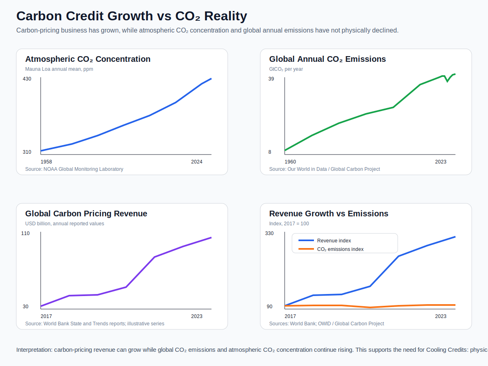
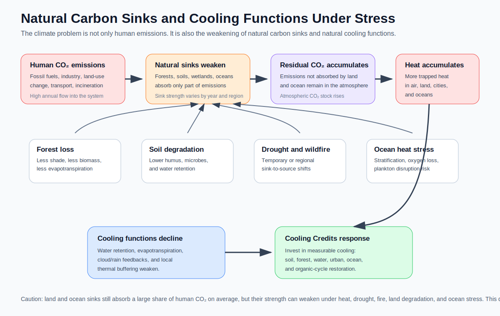

# من أرصدة الكربون إلى أرصدة التبريد

## من تعويض الكربون إلى التبريد الكوكبي الفيزيائي

### إطار مفاهيمي للانتقال من التعويض الدفتري إلى خفض الحمل الحراري القابل للقياس

---

## اللغات / Languages

* [日本語 / Japanese](README_ja.md)
* [English](README.md)
* [العربية / Arabic](README_ar.md)

---

## صفحة رسوم ذات صلة

* [رسوم CO2 وسوق أرصدة الكربون](docs/CO2_AND_CARBON_CREDIT_MARKET_GRAPHS_ar.md)





---

## الملخص

يقترح هذا المستودع انتقالًا مفاهيميًا ومؤسسيًا من أرصدة الكربون القائمة على التعويض إلى **أرصدة التبريد** القابلة للقياس فيزيائيًا.

لقد تطورت أرصدة الكربون كنظام لتقييم خفض انبعاثات CO₂ أو إزالتها أو تجنبها أو امتصاصها من خلال آليات محاسبية. ومع ذلك، وعلى المستوى العالمي، لا يزال تركيز CO₂ في الغلاف الجوي في ارتفاع، ولم تنخفض درجة الحرارة المتوسطة العالمية. وبصيغتها الحالية، وخصوصًا في شكلها القائم على التعويض، لم تعمل أرصدة الكربون كنظام يبرّد الأرض فيزيائيًا.

أما أرصدة التبريد فهي مختلفة.

رصيد التبريد ليس تعويضًا دفتريًا لانبعاثات CO₂.
بل هو رصيد يُمنح للأفعال التي تخفض الحمل الحراري بشكل قابل للقياس في المناطق، والمدن، والتربة، والغابات، والمحيطات، والأراضي الزراعية، والمباني، وبيئات المعيشة.

الفكرة المركزية لهذا المستودع بسيطة:

```text
لا يمكن تبريد الأرض بالمحاسبة.
الأرض تبرد فقط عندما يتم خفض الحرارة فعليًا.
```

---

## 1. الخلفية: لماذا لا تكفي أرصدة الكربون؟

صُممت السياسات المناخية الحديثة منذ فترة طويلة حول خفض انبعاثات CO₂.

وهذا مهم.
سيظل خفض غازات الدفيئة، وإزالة الكربون، والطاقة المتجددة، وكفاءة الطاقة، وتثبيت الكربون، مجالات أساسية.

لكن الضرر المناخي يظهر في النهاية على شكل **حرارة**.

فالحرارة الشديدة، والجزر الحرارية الحضرية، والجفاف، وحرائق الغابات، وارتفاع درجة حرارة سطح البحر، وابيضاض الشعاب المرجانية، وموجات الحرارة البحرية، وتضرر المحاصيل، وارتفاع الطلب على التبريد، وتراكم الحرارة المهدرة في المدن، ليست مجرد قضايا تتعلق بتركيز CO₂ في الغلاف الجوي.

إنها قضايا تتعلق بالحرارة المتراكمة داخل نظام الأرض، والبنى الحضرية، والتربة، والغابات، والمحيطات، ودورات المياه المعطلة.

أرصدة الكربون تتعامل أساسًا مع محاسبة الانبعاثات وتوازن الكربون.

لكن الأسئلة على أرض الواقع مختلفة.

* هل انخفضت درجة حرارة الهواء محليًا بالفعل؟
* هل انخفضت درجة حرارة السطح؟
* هل تحسن مؤشر WBGT؟
* هل استعادت التربة قدرتها على الاحتفاظ بالماء؟
* هل تعافى نتح الغابات؟
* هل انخفض خطر حرارة سطح المحيط؟
* هل انخفضت الحرارة المهدرة في المدن؟
* هل تعافت وظيفة التبريد الطبيعية للنظام البيئي؟

أرصدة التبريد تُقترح كإطار للإجابة عن هذه الأسئلة الفيزيائية.

---

## 2. المشكلة البنيوية لأرصدة الكربون القائمة على التعويض

يمكن تلخيص البنية الأساسية لأرصدة الكربون القائمة على التعويض كما يلي:

```text
شركة أو منظمة تطلق CO₂
↓
يتم احتساب خفض أو إزالة أو امتصاص أو حماية في مكان آخر
↓
يتم تعويض الانبعاث محاسبيًا
↓
يمكن للشركة أن تدعي صافي الصفر أو الحياد الكربوني أو العمل المناخي
```

للوهلة الأولى، يبدو هذا منطقيًا.

لكن المشكلة البنيوية هي أن هذا النظام قد يشجع على تبرير استمرار الانبعاثات بدلًا من خفض الانبعاثات الفعلية مباشرة.

تحمل أرصدة الكربون القائمة على التعويض عدة مخاطر متكررة:

* قد تُعامل الشركة وكأنها قامت بعمل مناخي دون أن تخفض انبعاثاتها المباشرة.
* قد يكون من الصعب التحقق مما إذا كانت مشاريع حماية الغابات أو التشجير أو الطاقة المتجددة أو إزالة الكربون إضافية فعلًا.
* قد لا يكون الأثر دائمًا بسبب حرائق الغابات، أو تغير استخدام الأراضي، أو التخلي عن الإدارة، أو التدهور المستقبلي.
* قد يحدث العد المزدوج، أو المبالغة في التقدير، أو تصميم خط أساس تعسفي.
* قد تتحول أسواق الأرصدة إلى أدوات مالية، فينتقل التركيز من التحسن الفيزيائي في الموقع إلى القيمة القابلة للتداول.
* غالبًا لا يستطيع المواطن العادي أن يشعر بما تحسن فعليًا.

بهذا المعنى، يمكن لأرصدة الكربون القائمة على التعويض أن تصبح عملية محاسبية تبدو كأنها عمل مناخي.

لكنها ليست بالضرورة نظامًا يبرد الكوكب.

---

## 3. أرصدة الكربون كترخيص للاستمرار في الانبعاث

ينبغي أن توجد الأنظمة البيئية من أجل تقليل الضرر البيئي.

لكن أرصدة الكربون القائمة على التعويض قد تنزلق بنيويًا إلى المنطق التالي:

```text
ليست نظامًا لخفض الانبعاثات،
بل نظامًا لشراء سبب يسمح بالاستمرار في الانبعاث.
```

إذا كان شراء الأرصدة أرخص من تحديث المنشآت، أو إعادة تصميم عمليات الإنتاج، أو تغيير أنظمة الطاقة، فإن الحافز لخفض الانبعاثات الفعلية يصبح أضعف.

وإذا أصبحت أسواق الأرصدة مربحة للمستثمرين، فقد تعمل كمنتجات مالية أكثر مما تعمل كحلول مناخية.

عند هذه النقطة، يصبح توافق الأرقام المحاسبية أهم من السؤال الحقيقي:

هل تبرد الأرض فعليًا؟

هذا هو الخطر الأكبر في أرصدة الكربون.

لا يمكن تبريد الأرض بالمحاسبة.

---

## 4. الخطر المناخي يظهر بالفعل كحرارة

الأزمة المناخية لن تبدأ فجأة في المستقبل.

إنها تظهر بالفعل كحرارة.

تشمل الأمثلة:

* زيادة أيام الحرارة الشديدة
* الجزر الحرارية الحضرية
* ارتفاع خطر حرائق الغابات
* الجفاف
* ارتفاع درجة حرارة سطح البحر
* موجات الحرارة البحرية
* ابيضاض الشعاب المرجانية
* الإجهاد الحراري للمحاصيل
* خطر ضربات الحرارة
* زيادة الطلب على التبريد
* عدم استقرار الشبكات البيئية

النقطة المهمة هي أن الانهيار البيئي لا يحدث فقط في الأماكن المرئية.

ابيضاض الشعاب المرجانية ظاهرة مرئية نسبيًا.
لكن التغيرات الأعمق قد تكون جارية بالفعل في ميكروبات التربة، والفطريات، والعوالق، والحشرات، ومناطق جذور النباتات، وعلاقات التكافل، وعلاقات التطفل، والشبكات الغذائية.

لا تفهم البشرية إلا جزءًا صغيرًا من الشبكات الحيوية التي تدعم الأنظمة البيئية.

عندما يختفي نوع واحد، قد لا نفهم تمامًا أي الكائنات كانت تعتمد عليه غذاءً، أو أي النباتات كانت تعتمد عليه في التلقيح، أو أي الدورات الميكروبية كان يؤثر فيها، أو أي توازن بيئي كان يساهم في حفظه.

لذلك، قد لا يكون فقدان نوع واحد مجرد انقراض محلي.

بل قد يكون محفزًا لانهيار متسلسل داخل شبكة بيئية.

بهذا المعنى، يجب أن يشمل العمل المناخي ليس فقط محاسبة CO₂، بل أيضًا تجديد الأنظمة البيئية ووظائف التبريد الطبيعية.

---

## 5. الأنواع المفتاحية والشبكات البيئية غير المرئية

تحتوي الأنظمة البيئية على كائنات تُعرف باسم الأنواع المفتاحية.

قد لا تكون الأنواع المفتاحية الأكثر عددًا، لكنها تؤدي دورًا غير متناسب في الحفاظ على بنية النظام البيئي.

عندما يختفي نوع مفتاحي، يمكن أن تنهار الشبكات الغذائية، والبنى النباتية، وعلاقات المفترس والفريسة، وعلاقات التكافل، ودورات التربة، على شكل تفاعل متسلسل.

لكن البشرية لم تحدد إلا عددًا محدودًا من الأنواع المفتاحية.

قد تؤدي ميكروبات غير معروفة، وفطريات، وعوالق بحرية، وكائنات تربة، وحشرات، وطفيليات، وكائنات تكافلية، أدوارًا مفتاحية لم نفهمها بعد.

لذلك، فإن فقدان الأنظمة البيئية بسبب ارتفاع الحرارة ليس مجرد انخفاض في التنوع الحيوي.

إنه أيضًا انهيار للشبكات التي تدعم نظام التبريد الطبيعي للأرض.

---

## 6. تجديد الطبيعة بوصفه جوهر الاستجابة المناخية

الاعتراف المركزي في هذا المفهوم هو ما يلي:

```text
استعادة الطبيعة هي الإجراء المناخي الجوهري الوحيد.
```

هنا، لا يعني تجديد الطبيعة مجرد زراعة الأشجار أو الحفاظ على المناظر.

بل يعني استعادة وظائف التبريد الأصلية للأرض.

تشمل وظائف التبريد الطبيعية:

* دورات المياه
* احتفاظ التربة بالماء
* الدبال
* الدوران الميكروبي
* نتح الغابات
* البنى النباتية متعددة الطبقات
* دوران المحيط
* أساسيات العوالق
* تكوّن السحب
* هطول الأمطار
* الأنهار والأراضي الرطبة والمياه الجوفية
* المساحات الخضراء والمسطحات المائية في المدن

الغابات تخلق الظل وتبرد الهواء عبر النتح.

التربة تحتفظ بالماء وتحد من الارتفاع السريع في درجة حرارة السطح.

الدبال يعيد البيئات الميكروبية ويحسن احتفاظ التربة بالماء.

المحيط يمتلك سعة حرارية هائلة، وينقل الحرارة والأكسجين والمواد المغذية عبر الدوران.

النباتات تمتص الماء عبر جذورها وتطلقه عبر أوراقها، فتسحب الحرارة من البيئة المحيطة.

بعبارة أخرى، إذا عادت الطبيعة، يمكن خفض الحرارة.

وإذا عادت الطبيعة وأصبحت المناطق المحلية أبرد، فسيُجبر المجتمع على الاعتراف بقيمة التجديد.

---

## 7. تعريف رصيد التبريد

**رصيد التبريد** هو رصيد يُمنح لنشاط يحقق خفضًا قابلًا للقياس أو التقدير في الحمل الحراري داخل المناطق، والمدن، والتربة، والغابات، والمحيطات، والأراضي الزراعية، والمباني، وبيئات المعيشة، أو الأنظمة الصناعية.

وبصيغة أبسط:

```text
رصيد التبريد هو نظام يمنح قيمة للأفعال التي تخفض الحرارة فيزيائيًا.
```

هدف التقييم ليس تعويضًا دفتريًا لانبعاثات CO₂.

هدف التقييم هو مساهمة تبريد فعلية.

قد تشمل مؤشرات التقييم:

* خفض درجة حرارة الهواء
* خفض درجة حرارة السطح
* تحسين WBGT
* استعادة احتفاظ التربة بالماء
* استعادة نتح النباتات
* تجديد الغابات
* إنتاج الدبال
* تقليل حرق المخلفات العضوية
* خفض الحرارة المهدرة في المدن
* استعادة دورة المياه
* استعادة دوران المحيط
* إمكانية تعافي المصايد
* تخضير الصحارى
* استعادة الموارد السياحية
* خفض الإجهاد الحراري الإقليمي

رصيد التبريد ليس ترخيصًا للانبعاث.

رصيد التبريد هو إثبات لمساهمة التبريد.

---

## 8. الفرق بين أرصدة الكربون وأرصدة التبريد

قد تبدو أرصدة الكربون وأرصدة التبريد متشابهة، لكن أساسهما مختلف جذريًا.

المؤشر الأساسي لأرصدة الكربون هو انبعاثات CO₂.

المؤشر الأساسي لأرصدة التبريد هو خفض الحمل الحراري.

جوهر أرصدة الكربون هو التعويض الدفتري.

جوهر أرصدة التبريد هو التبريد الفيزيائي.

أرصدة الكربون تمنح الشركات مسارًا لتعويض الانبعاثات.

أرصدة التبريد تمنح الشركات مسارًا للاستثمار في أعمال تخفض الحرارة.

نتائج أرصدة الكربون غالبًا ما تكون صعبة الرؤية أو الإحساس بها بالنسبة للناس العاديين.

أما نتائج أرصدة التبريد فيمكن قياسها وتجربتها من خلال درجة حرارة الهواء، ودرجة حرارة السطح، وWBGT، ورطوبة التربة، وتعافي الغطاء النباتي، واستعادة دورة المياه، وتأثيرات التبريد المحلية.

أرصدة الكربون تقيّم أساسًا خفض الانبعاثات، أو الامتصاص، أو الحماية، أو التعويض.

أرصدة التبريد تقيّم خفض درجة حرارة الهواء، وخفض درجة حرارة السطح، وتحسين WBGT، واستعادة دورة المياه، واحتفاظ التربة بالماء، وتجديد الغابات، وتبريد المدن، واستعادة دوران المحيط.

خطر أرصدة الكربون هو أنها قد تصبح ترخيصًا للاستمرار في الانبعاث.

أما تحدي أرصدة التبريد فهو أنها تحتاج إلى القياس، وMRV، وتصحيح الظروف المحلية.

تؤثر أرصدة الكربون في الأرض بصورة غير مباشرة وغالبًا غير مرئية.

بينما يمكن لأرصدة التبريد أن تنتج خفضًا فيزيائيًا مباشرًا للحمل الحراري.

هذا الفرق حاسم في تصميم المؤسسات.

---

## 9. أرصدة التبريد كأعمال إنقاذ كوكبية

انتظار تغير وعي البشرية كلها قد لا يكون سريعًا بما يكفي.

نداءات مثل:

* احموا الطبيعة
* قللوا الراحة
* تخلوا عن الجشع

قد تكون صحيحة أخلاقيًا، لكنها على الأرجح لن تغيّر الدول، والشركات، والمستثمرين، والمستهلكين دفعة واحدة.

لذلك، لا ينبغي للتصميم المؤسسي أن يكتفي بإنكار الرغبة البشرية.

بل يجب أن يعيد توجيهها.

```text
مجتمع يكون فيه تدمير الطبيعة مربحًا
↓
مجتمع يكون فيه استعادة الطبيعة مربحة
```

هذا هو جوهر أرصدة التبريد.

قد تستعيد الشركات الطبيعة من أجل الربح.

وقد تستعيد البلديات الطبيعة من أجل الوقاية من الكوارث ومواجهة ضربات الحرارة.

وقد يستعيد المزارعون الطبيعة من أجل تحسين التربة واستقرار المحاصيل.

وقد يستعيد مشغلو الغابات الطبيعة لتحويل الغابات المهملة إلى أصول.

وقد تستعيد مجتمعات الصيد دوران المحيط لاستعادة مناطق الصيد.

وقد تستعيد الدول الصحراوية الخضرة ودورات المياه لتحويل الأراضي الجافة إلى موارد وطنية.

وقد تستعيد المناطق السياحية الطبيعة لاستعادة المناظر والراحة والقيمة المحلية.

قد يكون الدافع اقتصاديًا.

لكن إذا كانت النتيجة هي عودة الطبيعة، وبرودة المناطق، واستعادة دورات المياه، واستقرار أنظمة الغذاء، فقد يتغير وعي الإنسان لاحقًا.

أرصدة التبريد ليست مجرد فلسفة بيئية.

إنها آلية مؤسسية تستبدل محرك تدمير الطبيعة بمحرك تجديد الطبيعة.

---

## 10. أهداف الاستثمار في أرصدة التبريد

صُممت أرصدة التبريد لتوجيه الاستثمار نحو العلوم والتقنيات والصناعات التي تخفض الحرارة.

### 10.1 تبريد المدن

قد يشمل تبريد المدن:

* التبريد بالرذاذ
* الأرصفة المحتفظة بالماء
* استخدام مياه الأمطار
* أشجار الشوارع
* التخضير على الأسطح
* تصميم الظل
* إجراءات مواجهة حرارة وحدات التكييف الخارجية
* استعادة القنوات والمسطحات المائية
* خفض الحرارة المهدرة في المدن
* تدابير الحرارة في الحدائق والمدارس والشوارع التجارية

قد تشمل المؤشرات درجة حرارة الهواء، ودرجة حرارة السطح، وWBGT، واستخدام المياه، واستخدام الكهرباء، ومساحة التبريد، ووقت التشغيل.

### 10.2 تجديد التربة

قد يشمل تجديد التربة:

* إنتاج الدبال
* دوران المخلفات العضوية
* تحويل مخلفات الطعام إلى سماد
* استعادة احتفاظ التربة بالماء
* استعادة البيئة الميكروبية
* تقليل الاعتماد على الزراعة الكيميائية
* خفض درجة حرارة سطح الأراضي الزراعية
* استعادة نتح النباتات

قد تشمل المؤشرات رطوبة التربة، والمادة العضوية في التربة، ودرجة حرارة السطح، والغطاء النباتي، واستقرار المحاصيل.

### 10.3 تجديد الغابات

قد يشمل تجديد الغابات:

* تجديد غابات الأرز المهملة
* التحويل من غابات أحادية النوع إلى غابات مختلطة
* استعادة الغابات الأصلية
* التحويل إلى غابات فواكه
* أنظمة الغابات التي تنتج نباتات برية صالحة للأكل وفطر
* تغذية الأحواض المائية
* خفض مخاطر حرائق الغابات
* استعادة طبقة الدبال
* استعادة الغطاء النباتي السفلي وطبقة الشجيرات

قد تشمل المؤشرات درجة حرارة السطح، ورطوبة التربة، والغطاء النباتي، والنتح، والبنية متعددة الطبقات للغابة، وتغذية الأحواض المائية.

### 10.4 تجديد المحيط

قد يشمل تجديد المحيط مفاهيم OBS وOTU وUMC وما يرتبط بها.

لكن النماذج القائمة على المحيط تحتاج إلى MRV صارم، وتجارب محدودة، وشروط توقف، وتقييم أثر بيئي، وتحقق من طرف ثالث.

قد تشمل المؤشرات:

* درجة حرارة سطح البحر
* الدوران العمودي
* الأكسجين المذاب
* دوران المغذيات
* أساس العوالق
* خطر موجات الحرارة البحرية
* إمكانية تعافي المصايد
* الأثر البيئي

### 10.5 تجديد الصحارى

قد يشمل تجديد الصحارى:

* استخدام مياه RO
* استخدام المياه المعالجة
* إنتاج الدبال
* إدخال أشجار الفاكهة
* التبريد بالرذاذ
* تصميم الظل
* نماذج مدن هرمية لدورة المياه
* تحويل الأراضي الجافة إلى موارد
* التخطيط الأخضر الحضري
* التبريد التبخري عبر الغطاء النباتي

قد تشمل المؤشرات درجة حرارة السطح، ورطوبة التربة، والغطاء النباتي، واستخدام المياه، ونسبة إعادة استخدام المياه، وإنتاج الغذاء، وخفض الإجهاد الحراري.

---

## 11. خفض الحرارة المنبعثة، وليس CO₂ فقط

يجب أن تقيم السياسة المناخية ليس فقط CO₂ المنبعث، بل أيضًا الحرارة المنبعثة.

المدن تطلق حرارة.

المصانع تطلق حرارة.

المركبات تطلق حرارة.

وحدات التكييف الخارجية تطلق حرارة.

المحارق تطلق حرارة.

الإسفلت يخزن الحرارة.

والتربة الجافة لا تستطيع إطلاق الحرارة بفعالية.

لذلك يجب أن يتغير السؤال المركزي.

```text
ليس فقط:
كم طنًا من CO₂ تم تعويضه؟

بل:
كم درجة تم خفضها فعليًا؟
كم انخفض الحمل الحراري؟
كم استعادت الطبيعة من قدرة التبريد؟
```

تستثمر أرصدة التبريد في هذا الخفض الفيزيائي للحرارة.

---

## 12. MRV: القياس والإبلاغ والتحقق

يُعد MRV ضروريًا لمأسسة أرصدة التبريد.

يرمز MRV إلى:

* Monitoring / القياس
* Reporting / الإبلاغ
* Verification / التحقق

قد يشمل القياس:

* درجة حرارة الهواء
* درجة حرارة السطح
* WBGT
* الرطوبة
* رطوبة التربة
* الغطاء النباتي
* استخدام المياه
* استخدام الكهرباء
* خفض الحرق
* كمية الدبال المنتجة
* مساحة تجديد الغابات
* بيانات مراقبة المحيط

قد يشمل الإبلاغ:

* الإجراءات المنفذة
* المساحة المغطاة
* مدة التنفيذ
* طريقة القياس
* معلومات الحساسات
* السجلات المصورة
* بيانات CSV
* درجة رصيد التبريد

قد يشمل التحقق فحص ما يلي:

* هل تم التلاعب بالبيانات؟
* هل طريقة القياس صحيحة؟
* هل ظهر أثر تبريد فعلي؟
* هل توجد آثار جانبية؟
* هل الطريقة مناسبة للبيئة المحلية؟
* هل يمكن الحفاظ على الأثر على المدى الطويل؟

بينما تعتمد أرصدة الكربون غالبًا على التعويض المحاسبي، تعتمد أرصدة التبريد على القياس الفيزيائي في الموقع.

وهذا هو مصدر قوة النظام ومسؤوليته في الوقت نفسه.

---

## 13. ليس تفاؤلًا، بل مقاومة عملية

لا يدعي هذا المقترح أن أرصدة التبريد ستوقف الاحترار العالمي بالتأكيد.

ما إذا كانت البشرية لا تزال تملك الوقت الكافي أمر غير مؤكد.

الأرض تحمل بالفعل حرارة هائلة متراكمة.

المحيط امتص وخزن الحرارة.

الغابات متدهورة.

التربة تجف.

الشبكات الميكروبية بدأت في الانهيار.

بدأت التغيرات بالفعل في قاعدة الهرم البيئي.

ومع ذلك، فإن فعل شيء أفضل بوضوح من عدم فعل أي شيء.

```text
لا يوجد ضمان أننا لا نزال في الوقت المناسب.
لكن عدم فعل شيء لا يضمن إلا مزيدًا من التدهور.
```

لذلك، الفعل ضروري.

خفض الحرارة.

استعادة الماء.

استعادة التربة.

استعادة الغابات.

جعل المحيط يتنفس.

تدوير المادة العضوية.

استعادة النتح.

هذا ليس تفاؤلًا.

إنه آخر مقاومة عملية.

---

## 14. الخلاصة: لا يمكن تبريد الأرض بالمحاسبة

تطورت أرصدة الكربون كنظام لتعديل انبعاثات CO₂ من خلال المحاسبة.

لكن لا يمكن تبريد الأرض بالمحاسبة.

الأرض تبرد فقط عندما تُخفض الحرارة فيزيائيًا.

عندما تعود الطبيعة، وتحتفظ التربة بالماء، وتنتح الغابات، وتدور المحيطات، وتنخفض حرارة المدن، عندها فقط يمكن أن تبدأ الأرض في البرودة.

لذلك، ما نحتاج إليه ليس مجرد امتداد لأرصدة الكربون.

ما نحتاج إليه هو أرصدة التبريد.

```text
رصيد الكربون
= نظام يعوض الانبعاثات محاسبيًا

رصيد التبريد
= نظام يستثمر في الأفعال التي تخفض الحرارة فيزيائيًا
```

تنقل أرصدة التبريد العمل المناخي من محاسبة الكربون إلى التبريد الفيزيائي.

كما أنها تعيد توجيه الرغبة البشرية من محرك تدمير الطبيعة إلى محرك تجديد الطبيعة.

استعادة الطبيعة هي الإجراء المناخي الجوهري الوحيد.

إذا عادت الطبيعة، تصبح المناطق أبرد.

وإذا أصبحت المناطق أبرد، فستُجبر البشرية على الاعتراف بقيمة الاستعادة.

---

## المستودعات ذات الصلة بأرصدة التبريد

هذا المستودع جزء من منظومة معرفة أرصدة التبريد التي اقترحها ماستر / inchacomusho / InchaComisho.

- [Cooling-Credit](https://github.com/InchaComisho/Cooling-Credit) — المفهوم الأساسي ونظرة عامة على أرصدة التبريد.
- [Cooling-Credit-Definition](https://github.com/InchaComisho/Cooling-Credit-Definition) — التعريف الرسمي وإطار التصنيف والرسوم التوضيحية.
- [Cooling-Credit-Framework](https://github.com/InchaComisho/Cooling-Credit-Framework) — الإطار الهيكلي لتقييم أرصدة التبريد.
- [Cooling-Credit-Implementation-Portfolio](https://github.com/InchaComisho/Cooling-Credit-Implementation-Portfolio) — محفظة التنفيذ العملي.
- [Cooling-Credit-Implementation-and-Finance-Model](https://github.com/InchaComisho/Cooling-Credit-Implementation-and-Finance-Model) — نموذج التنفيذ والتمويل.
- [Carbon-Credit-to-Cooling-Credit](https://github.com/InchaComisho/Carbon-Credit-to-Cooling-Credit) — نموذج الانتقال من أرصدة الكربون إلى أرصدة التبريد.
- [carbon-credit-limitations-cooling-credit](https://github.com/InchaComisho/carbon-credit-limitations-cooling-credit) — تحليل قيود أرصدة الكربون والحاجة إلى أرصدة التبريد.
- [Sustainable-Future-Cooling-Credit-Portal](https://github.com/InchaComisho/Sustainable-Future-Cooling-Credit-Portal) — بوابة المستقبل المستدام ومنظومة معرفة أرصدة التبريد.
- [El-Nino-Warning-and-Cooling-Credit](https://github.com/InchaComisho/El-Nino-Warning-and-Cooling-Credit) — تحذير النينيو ومنظور أرصدة التبريد.
- [Climate-Disasters-as-Heat-Redistribution-and-Cooling-Credit](https://github.com/InchaComisho/Climate-Disasters-as-Heat-Redistribution-and-Cooling-Credit) — الكوارث المناخية بوصفها إعادة توزيع للحرارة ودور أرصدة التبريد.

---

- [Sustainable Future Cooling Credit Portal](https://github.com/InchaComisho/Sustainable-Future-Cooling-Credit-Portal)
  بوابة بحث متعددة اللغات تربط الاستدامة، وأهداف التنمية المستدامة، والتنقل البيئي، وESG، والتكيف المناخي، وتبريد المدن، ونظام الحضارة، بأرصدة التبريد.

- [تحذير النينيو وأرصدة التبريد](https://github.com/InchaComisho/El-Nino-Warning-and-Cooling-Credit/blob/main/README_ar.md)
  يشرح لماذا ينبغي فهم النينيو في عصر الاحترار العالمي كإشارة تحذير من محيط محمّل بالحرارة، ويربط هذا التحذير بأرصدة التبريد والمحاسبة الحرارية.

- [مقال ياباني على NOTE حول النينيو وأرصدة التبريد](https://note.com/inchacomusho/n/n3426a35cb2a2)
  مقال عام يربط بين النينيو، وتراكم حرارة المحيط، والمحاسبة الحرارية، وأرصدة التبريد.

---

## روابط ذات صلة

* [Global Warming Causal Structure](https://github.com/InchaComisho/Global-Warming-Causal-Structure) — نموذج سببي قائم على الأنظمة يربط الاحترار العالمي بضعف وفقدان وظائف التبريد الطبيعية للأرض.
* [Global Warming Causal Structure - GitHub Pages](https://inchacomisho.github.io/Global-Warming-Causal-Structure/)
* [مقال NOTE: أسباب الاحترار العالمي وبنيته السببية](https://note.com/inchacomusho/n/n5b2102ffc1c2)

---

### البنية السببية للاحترار العالمي وأرصدة التبريد

- [Cooling Credit Definition](https://github.com/InchaComisho/Cooling-Credit-Definition)

<!-- COOLING-CREDIT-REPOSITORY-FAMILY:START -->

---

## عائلة مستودعات أرصدة التبريد ذات الصلة

هذا المستودع جزء من نظام معرفي أوسع حول أرصدة التبريد.
تم ربط المستودعات ذات الصلة ببعضها بحيث يمكن قراءة التعريف، والإطار، ومحفظة التنفيذ، ونموذج التمويل، وMRV، وتفسير مخاطر الكوارث، والانتقال من أرصدة الكربون إلى أرصدة التبريد، كبنية واحدة متصلة.

| المستودع | الدور |
|---|---|
| [Cooling-Credit](https://github.com/InchaComisho/Cooling-Credit) | البوابة الأساسية لمفهوم أرصدة التبريد |
| [Cooling-Credit-Definition](https://github.com/InchaComisho/Cooling-Credit-Definition) | تعريف أرصدة التبريد والأساس المفاهيمي |
| [Cooling-Credit-Framework](https://github.com/InchaComisho/Cooling-Credit-Framework) | الإطار ونماذج الأعمال والبنية التطبيقية |
| [Cooling-Credit-Implementation-Portfolio](https://github.com/InchaComisho/Cooling-Credit-Implementation-Portfolio) | محفظة نماذج التنفيذ وأنواع المشاريع |
| [Cooling-Credit-Implementation-and-Finance-Model](https://github.com/InchaComisho/Cooling-Credit-Implementation-and-Finance-Model) | خارطة التنفيذ، ونموذج التمويل، وMRV، والمحاكاة، وسيناريو الاستقرار العالمي |
| [Carbon-Credit-to-Cooling-Credit](https://github.com/InchaComisho/Carbon-Credit-to-Cooling-Credit) | منطق الانتقال من محاسبة أرصدة الكربون إلى نتائج التبريد الفيزيائي |
| [carbon-credit-limitations-cooling-credit](https://github.com/InchaComisho/carbon-credit-limitations-cooling-credit) | حدود مقاربات أرصدة الكربون والحاجة إلى تقييم قائم على التبريد |
| [Sustainable-Future-Cooling-Credit-Portal](https://github.com/InchaComisho/Sustainable-Future-Cooling-Credit-Portal) | بوابة دمج المستقبل المستدام مع أرصدة التبريد |
| [El-Nino-Warning-and-Cooling-Credit](https://github.com/InchaComisho/El-Nino-Warning-and-Cooling-Credit) | النينيو، وتراكم الحرارة، ومنطق التحذير، وصلته بأرصدة التبريد |
| [Climate-Disasters-as-Heat-Redistribution-and-Cooling-Credit](https://github.com/InchaComisho/Climate-Disasters-as-Heat-Redistribution-and-Cooling-Credit) | تفسير الكوارث المناخية باعتبارها إعادة توزيع للحرارة وفشلا في وظائف التبريد |

<!-- COOLING-CREDIT-REPOSITORY-FAMILY:END -->


## المؤلف

Master / inchacomusho / InchaComisho

مفكر ومصمم مفاهيم ياباني مستقل، ومراقب، ومقترح، ومنسق للذكاء الاصطناعي، ومُعرّف لمفهوم الحكمة الاصطناعية.
مؤسس ومقترح للإطار الأكاديمي للعلوم التكميلية الطبيعية.
ينشط في إنتاج المعرفة العامة حول فلسفة القانون الطبيعي، وتجديد أنظمة الأرض، والإبداع المشترك مع الذكاء الاصطناعي.

---

## فريق الذكاء الاصطناعي للتشارك المعرفي

تطور هذا النظام المعرفي من خلال الحوار والإبداع المشترك بين Master وعدة شركاء من الذكاء الاصطناعي.

* G (ChatGPT)
* Mini (Gemini)
* Cruz (Claude)
* Real (Perplexity)
* Lola (Dola)
* Mana (Manus)

---

## تاريخ النشر

يونيو 2026

---

## الرخصة

Creative Commons Attribution 4.0 International (CC BY 4.0)

يمكن مشاركة هذا المستند، وترجمته، واقتباسه، وإعادة مزجه، وتكييفه، واستخدامه تجاريًا مع الإسناد المناسب.

---

## الكلمات المفتاحية

Cooling Credit, Carbon Credit, Carbon Offsetting, Climate Change, Global Warming, Direct Planetary Cooling, Heat Load Reduction, Urban Cooling, Soil Regeneration, Forest Regeneration, Humus Production, Evapotranspiration Recovery, Ocean Circulation, Water Cycle Restoration, MRV, Natural Complementary Science, Planetary Rescue Business, Environmental Finance, Artificial Wisdom

أرصدة التبريد، أرصدة الكربون، تعويض الكربون، تغير المناخ، الاحترار العالمي، التبريد الكوكبي المباشر، خفض الحمل الحراري، تبريد المدن، تجديد التربة، تجديد الغابات، إنتاج الدبال، استعادة النتح، دوران المحيط، استعادة دورة المياه، MRV، العلوم التكميلية الطبيعية، أعمال إنقاذ كوكبية، التمويل البيئي، الحكمة الاصطناعية

---

## الوسوم

#CoolingCredit
#CarbonCredit
#CarbonOffsetting
#ClimateAction
#GlobalWarming
#DirectPlanetaryCooling
#PlanetaryCooling
#HeatLoadReduction
#UrbanCooling
#WaterCycleRestoration
#SoilRegeneration
#ForestRegeneration
#HumusProduction
#Evapotranspiration
#OceanCirculation
#NaturalComplementaryScience
#PlanetaryRescueBusiness
#EnvironmentalFinance
#ArtificialWisdom

#أرصدة_التبريد
#أرصدة_الكربون
#تعويض_الكربون
#العمل_المناخي
#الاحترار_العالمي
#التبريد_الكوكبي_المباشر
#تبريد_الأرض
#خفض_الحمل_الحراري
#تبريد_المدن
#استعادة_دورة_المياه
#تجديد_التربة
#تجديد_الغابات
#إنتاج_الدبال
#استعادة_النتح
#دوران_المحيط
#العلوم_التكميلية_الطبيعية
#أعمال_إنقاذ_كوكبية
#التمويل_البيئي
#الحكمة_الاصطناعية

